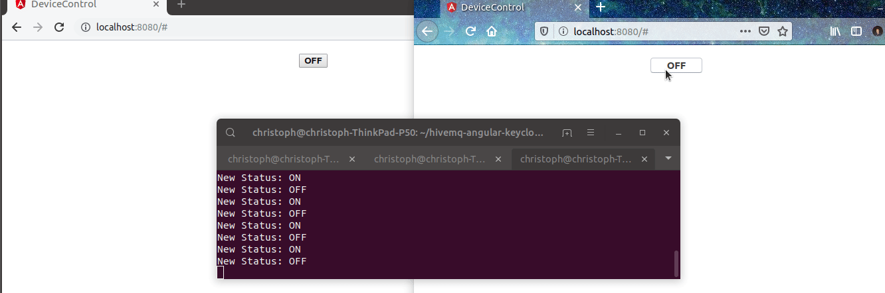

# MQTT meets Web - Connecting Webapps over MQTT
These are the sources to this 
[Blogarticle](https://www.novatec-gmbh.de/blog/mqtt-meets-web-anbindung-von-webapps-ueber-mqtt) (in German)

Runs on `docker` and starts by `docker-compose up`
Additionally you should add `127.0.0.1 keycloak` add the end of your `/etc/hosts`

Before starting the "mockdevice" install the requirements first using `pip3 install -r mockdevice/requirements.txt`. After that you're able to start the script using `python3 mockdevice/script.py`

